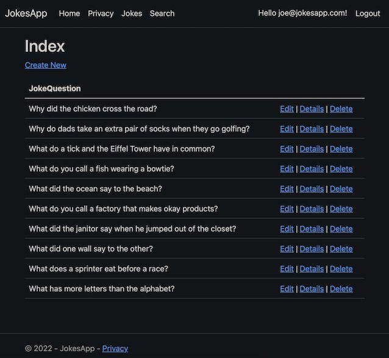
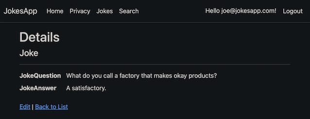
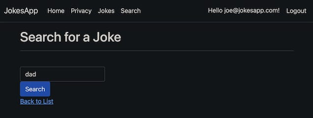

# The Jokes App
## About
This is an ASP.NET Core web app for jokes with CRUD operations.
It's a code-along project following [this tutorial](https://www.youtube.com/watch?v=BfEjDD8mWYg&t=28s) by [Shad Sluiter](https://www.youtube.com/user/shadsluiter).

## Screenshots

## Get Started
1. Download the source code on `master` branch.
2. Open using `Microsoft Visual Studio`, `JetBrains Rider`, or any other C# IDEs
3. (OPTIONAL) If you're using `JetBrains Rider`, connect to the project database via file `./app.db`
4. Build and run the app.
